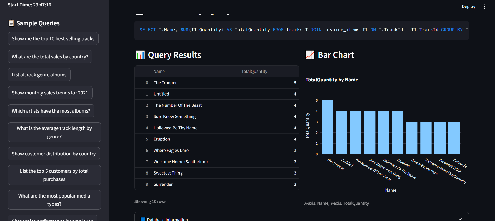

"""
# Text-to-SQL Assistant

A Streamlit application that converts natural language queries into SQL queries and visualizes the results.



## Features

- Natural language to SQL conversion using Groq's Llama 3.3
- Automatic chart generation (Bar, Pie, Line charts)
- Interactive Streamlit interface
- Support for Chinook sample database
- Sample queries for quick testing

## Setup

1. Clone the repository
2. Install dependencies: `pip install -r requirements.txt`
3. Download Chinook database and place `chinook.db` in root directory
4. Set up environment variables:
   ```
   GROQ_API_KEY=your_groq_api_key
   ```
5. Run the application: `streamlit run app.py`

## Usage

1. Enter a natural language question
2. Click "Process Query" 
3. View the generated SQL query
4. See results in table format
5. View automatic chart if applicable

## Sample Queries

- "Show me the top 10 best-selling tracks"
- "What are the total sales by country?"
- "List all rock genre albums"
- "Show monthly sales trends"
- "Which artists have the most albums?"

## Deployment

Deploy to Streamlit Cloud by connecting your GitHub repository.
"""